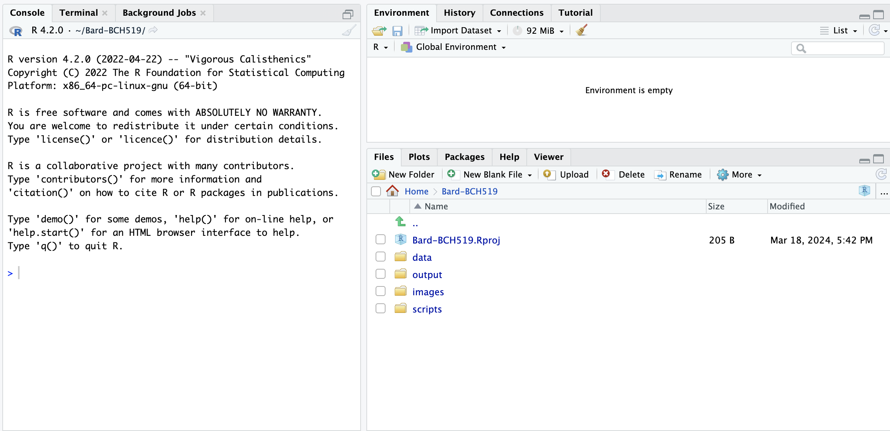

# Basic of R

* R is a programming language originally developed in 1993 for statistical analysis.
* R is an interpreted language, meaning that there is no need for compiling, just like python.
* R is considered a functional language (Declarative programming), meaning that most code centers on executing functions.
  * Program logic is dictated by function executions rather than algorithm flow.
  * Imperative Approaches (java, python, perl, C) focus more on loops, conditionals.
  * Each function is designed to do a specific task like sum(), average(), log()

## RStudio

* RStudio is an integrated development enviornment (IDE) for R. Similar to Jupyter Notebooks, Eclipse, PyCharm...
  * RStudio is layered ontop of the underlying R programming language.
  * Desktop versions are available, as well as on CCR OnDemand. 
* Navigate to [CCR OOD](https://docs.ccr.buffalo.edu/en/latest/portals/ood/).
* Scroll down to GUIs and choose the RStudio Server CCR Release 2023.01
* Choose BCH519, Class, Class, 2 hours, 10,000 MB of RAM
* Wait momentairly for a node to launch with the interactive session.
* When ready, click on "Connect to RStudio Server" and a new window should open with your RStudio Interface

## Setting up your first RStudio Project
* Projects are an easy way to keep analysis clean and organized.
  - To create your first project, at the top select File > New Project > New Directory > New Project
  - Decide on your projects name, I would suggest something meaningful like "Bard-BCH519"
  - Choose the directory location on the server that you would like to keep the data.
    - "~" is short hand for the home directory

* Organization is key! Start a project nice and tidy. I typically recommend the minimum folder structure of:
  - > data : contains all of your input datasets planned for this project
  - > output : contains any saved, processed files like output tables or processed RData files
  - > scripts : contains all of your R scripts for the project. 
  - > images : captures Any output images/figures that you have generated from your analysis

* Note this directory structure is the bare minimum. For a [much more detailed plan, look here for inspiration](https://datamanagement.hms.harvard.edu/plan-design/directory-structure)

